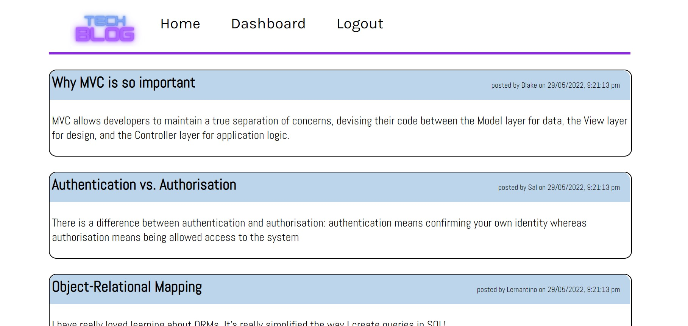
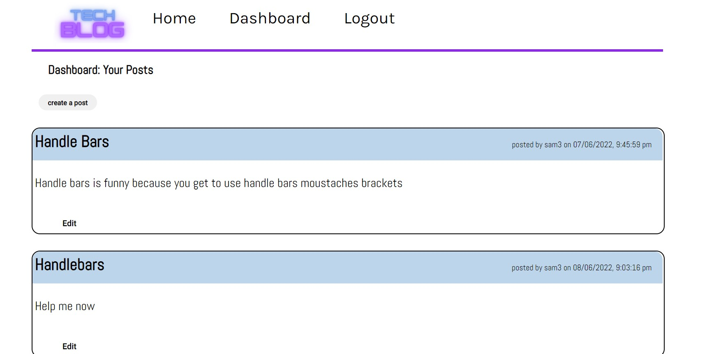

# tech_blog
  
## Description
Web appliation to assist with people on the internet to post thought and comments about different technology. Users can create an account to post message on the blog, can comment on other people's posts and edit or delete their own posts if they feel the need. 

Page is responsive and gives users a good experience in mobile view. 
## Table of Contents
- [Instation Instructions](#installation-instructions)
- [Usage Instructions](#usage-instructions)
- [Screen Shots](#screen-shots)
- [Repository Link](#repository-link)
- [Video Link](#video-link)
- [References](#references)

## Installation Instructions
Put the following commands into your terminal before running the server.js
// npm init
// npm i express
// npm i 

## Usage Insturctions

Please install all packages before starting. Run both schema files (create.sql & seeds.sql) in the mysql terminal before running the node app.js in your terminal 

Make sure to update the .env file to assist with you seeding a database

## Screen Shots
Home Page  

Dashboard  

Comments  

Update and Edit  

## Repository Link
To find out more information about this repo please visit my github page https://github.com/Samw1s3/tech_blog

## Video Link
https://drive.google.com/file/d/1jjZzGmnQuiHrWGZYRlc3U1kx2WC0xilw/view

## References
https://stackoverflow.com/
https://www.w3schools.com/sql/sql_join.asp
